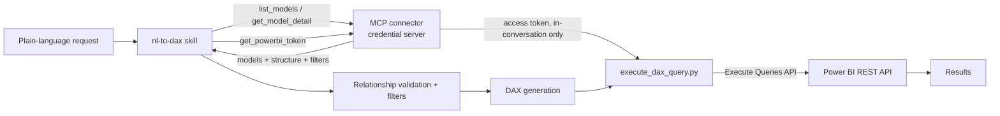

# nl-to-dax (mcp-oauth branch)

A Claude Skill that turns natural-language requests into executable DAX queries against Power BI, built around the Power BI REST API. Describe what you need (Chinese or English) and the skill handles authentication checks, model selection, relationship validation, and filter application, then executes the query through the **nl-to-dax MCP connector** and returns the results.

> Authentication is MCP connector + OAuth — no key application, copying, or manual configuration of any credential.

## Features

| Feature | Description |
|---|---|
| MCP authentication | OAuth authorization completes in Claude's Settings → Connectors; the skill never holds Azure AD secrets |
| Multi-model support | Lists all Power BI datasets assigned to the user for selection at startup |
| Model overview | Prefers the admin-authored model description (token-efficient); falls back to auto-summarizing tables and measures |
| Smart filter application | Matches request keywords against centrally managed filter rules and applies them to the DAX query |
| Relationship validation | Verifies inter-table relationships before generating DAX; asks the user when a join path has gaps |
| DAX generation | Emits complete, REST-API-compliant queries (including `EVALUATE`) |
| Direct API execution | Executes queries with an MCP-issued access token that lives only in the current conversation — never written to disk, never persisted across conversations |

## How it works



## Requirements

- Claude, in any MCP-connector-capable interface (e.g., Claude Code, Claude Apps)
- The nl-to-dax MCP connector added under Settings → Connectors
- Git (optional; used only for the daily version check, silently skipped if unavailable)

## Installation

1. Place the `nl-to-dax/` directory in a skill path Claude reads — project-level `.claude/skills/nl-to-dax/` or user-level `~/.claude/skills/nl-to-dax/`
2. Copy `nl-to-dax/config/site_domain.json.example` to `site_domain.json` and fill in the credential server's domain (e.g., `nl-to-dax.example.com`, no `https://` prefix)

## First-time setup

Run `/nl-to-dax` — if the MCP connector isn't connected yet, the skill walks you through it:

1. Register an account on the credential server if you don't have one
2. Wait for admin approval
3. Add the MCP server in Claude (name: `nl-to-dax_credential-server`, URL: `https://{server-domain}/mcp`) and log in with your credential-server account when the OAuth page opens
4. Re-run `/nl-to-dax` (CLI users: start a new conversation for the connector to take effect)

> Note: account approval is only one prerequisite — the admin must also configure your Azure AD credentials and assign semantic models before login succeeds. If login fails after approval, it's a backend-setup matter, not a connection issue.

## Usage

Run `/nl-to-dax` and describe your query:

```
Example: monthly order count and total amount by city, sorted by city
```

Pipeline: MCP auth check (`list_models`) → model selection and full structure retrieval (`get_model_detail`) → model overview → DAX generation → token acquisition (`get_powerbi_token`, cached within the conversation) → direct query execution → results.

## Filter rules

Business-rule filters are centrally maintained by administrators on the credential server (`/admin/pbi-configs`) and delivered through the `filters` field of `get_model_detail` — adding or changing rules requires no skill modification.

## Design notes

- The skill holds no underlying credentials; access tokens obtained via `get_powerbi_token` exist only in the conversation context and are never written to local files
- Model structures and query results are fetched in real time — no local cache to go stale when admins change a user's model assignments
- The server issues tokens but does not execute queries; DAX runs client-side via `execute_dax_query.py` against the Power BI REST API, so concurrent users can't block the server

## Related projects

- [credential_application_server](https://github.com/hugo2135/credential_application_server) — OAuth 2.1 authorization server + MCP server, user and model governance
- [bi_model_description](https://github.com/hugo2135/bi_model_description) — plain-language data-dictionary generation for BI models
